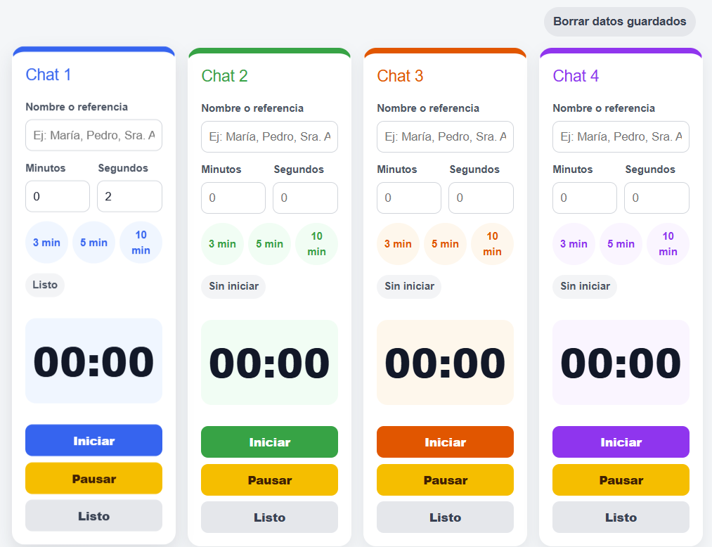

**_<h1 align="center">:vulcan_salute: Control de tiempos para conversaciones :computer:</h1>_**

<p align="center">
  Página web desarrollada con HTML, CSS y JavaScript para organizar tiempos de revisión en hasta 4 conversaciones activas.
</p>

<p align="center">
  <a href="AGREGAR_LINK_GITHUB_PAGES">Ver página web del proyecto</a>
</p>

<!-- --------------------------------------------------------- -->

**<h3>📌 Descripción</h3>**

<p>
  Este proyecto nace como una herramienta práctica para apoyar la gestión de varias conversaciones activas al mismo tiempo. 
  La idea principal es contar con una ayuda visual simple que permita controlar el tiempo entre respuestas, especialmente cuando se trabaja con distintos chats y se necesita evitar confusiones al cambiar de pestaña o conversación.
</p>

<p>
  La página permite usar hasta <b>4 temporizadores independientes</b>, cada uno asociado a un chat. 
  En cada tarjeta se puede anotar el nombre o referencia de la persona, definir un tiempo manualmente o seleccionar opciones rápidas de <b>3, 5 o 10 minutos</b>.
</p>

<p>
  El objetivo no es generar presión ni estrés adicional, sino entregar una herramienta amigable, clara y fácil de usar para personas que no necesariamente tienen conocimientos técnicos.
</p>

<!-- --------------------------------------------------------- -->

**<h3>✨ ¿Qué permite hacer este sitio?</h3>**

- Controlar hasta **4 conversaciones activas** de forma independiente.
- Escribir un **nombre o referencia de la persona** asociada a cada chat.
- Definir tiempos manuales usando minutos y segundos.
- Usar botones rápidos de **3 min, 5 min y 10 min**.
- Iniciar, pausar y marcar como listo cada temporizador.
- Recibir una señal visual cuando corresponde revisar un chat.
- Reproducir un sonido breve al finalizar el tiempo.
- Mantener los datos guardados en el navegador mediante `localStorage`.
- Borrar los datos guardados cuando sea necesario.

<!-- --------------------------------------------------------- -->

**<h3>🧠 Propósito del proyecto</h3>**

<p>
  El propósito de este proyecto es facilitar el seguimiento de conversaciones simultáneas, evitando errores al responder y reduciendo la carga mental que puede producir estar pendiente de varios tiempos a la vez.
</p>

<p>
  Por eso, la interfaz se diseñó con textos simples, colores suaves y acciones claras. 
  La prioridad fue crear una herramienta de apoyo, no un sistema complejo ni una aplicación que interrumpa el trabajo con alertas invasivas.
</p>

<!-- --------------------------------------------------------- -->

**<h3>🔐 Sobre el almacenamiento de datos</h3>**

<p>
  Este proyecto utiliza <b>localStorage</b>, por lo que los datos se guardan únicamente en el navegador de cada persona.
</p>

<p>
  La información no se envía a servidores, no se almacena en GitHub y no se comparte entre usuarios. 
  Si otra persona abre el mismo enlace desde otro computador o navegador, tendrá sus propios datos guardados de forma independiente.
</p>

<p>
  Se recomienda usar solo nombres o referencias simples, evitando ingresar datos sensibles como RUT, direcciones, teléfonos completos o información privada.
</p>

<!-- --------------------------------------------------------- -->

**<h3>🛠 Tecnologías utilizadas</h3>**

<p>
  
  
  
</p>

<!-- --------------------------------------------------------- -->

**<h3>📷 Vista previa</h3>**

<p>
  
</p>

<!-- --------------------------------------------------------- -->

**<h3>📚 Lo que practiqué en este proyecto</h3>**

- Manipulación del DOM con JavaScript.
- Uso de eventos mediante `addEventListener`.
- Manejo de temporizadores con `setInterval` y `clearInterval`.
- Control de estados independientes para cada tarjeta.
- Uso de `localStorage` para guardar información en el navegador del usuario.
- Lectura de atributos personalizados con `data-*`.
- Reproducción de audio desde JavaScript.
- Diseño responsive con CSS Grid y media queries.
- Construcción de una interfaz simple pensada para usuarios no técnicos.

<!-- --------------------------------------------------------- -->

**<h3>🎧 Créditos de audio</h3>**

<p>El sonido de alarma utilizado en este proyecto fue descargado desde Pixabay:</p>
<p>Sound Effect by 
  <a href="https://pixabay.com/es/users/freesound_community-46691455/?utm_source=link-attribution&utm_medium=referral&utm_campaign=music&utm_content=6402">freesound_community</a> 
  from 
  <a href="https://pixabay.com//?utm_source=link-attribution&utm_medium=referral&utm_campaign=music&utm_content=6402">Pixabay</a>.
</p>

<!-- --------------------------------------------------------- -->

**<h3>📁 Estructura del Proyecto:</h3>**

```bash
📁 control-tiempos-whatsapp
├── 🟧 index.html
├── 📘 README.md
└── 📁 assets
    ├── 📁 css
    │   └── 🟦 style.css
    ├── 📁 js
    │   └── 🟨 script.js
    └── 📁 sounds
    │   └── 🔊 freesound_community-alarm-clock-short.mp3
    └── 📁 img
        ├── 🖼️ reloj.png
        └── 🖼️ vista_previa.png
```